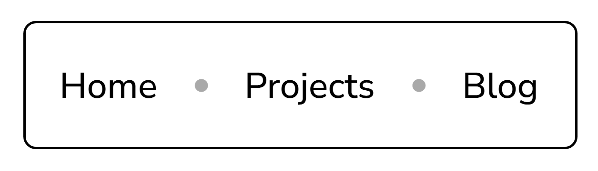
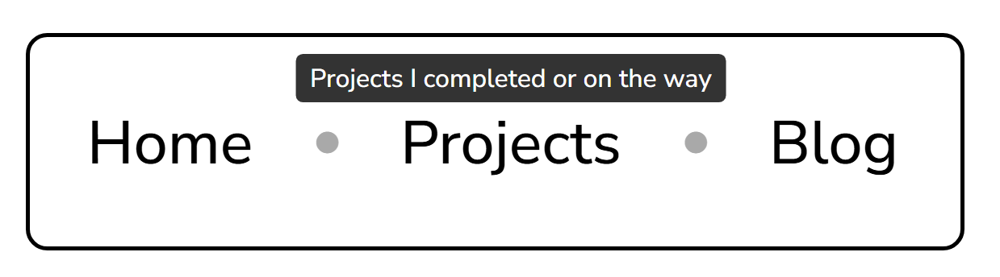

# Tooltip-UI
For this project, the goal is to create a tooltip that appears above navigation items when hovered, using only HTML and CSS. A tooltip is a small pop-up box that provides additional information about a navigation item when a user hovers over it. This project will focus on mastering CSS positioning, hover effects, and creating visually appealing tooltips without relying on JavaScript.

# Link to Roadmap.sh
https://roadmap.sh/projects/tooltip-ui

# Objective of this Project
The goal of this project is to understand how to use CSS for dynamic UI effects. The objective is to learn how to position elements relative to each other, create smooth transitions, and make navigation more interactive and user-friendly.

# Challenges
I had a lot of challege gettin ght ehovering to work with only CSS. I tried to use hover but it did not work. I used AI to help me with the positioning of the hovering box over the list items.

# Screenshot
### Base Navigation Bar

### Hovering Over

